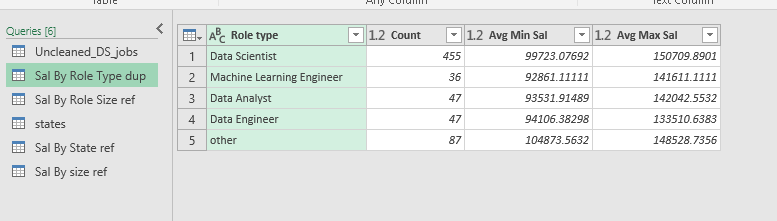
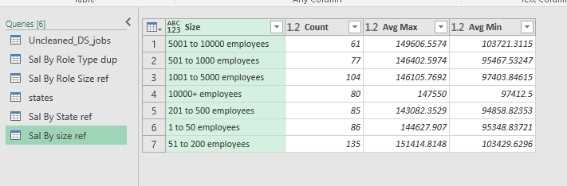
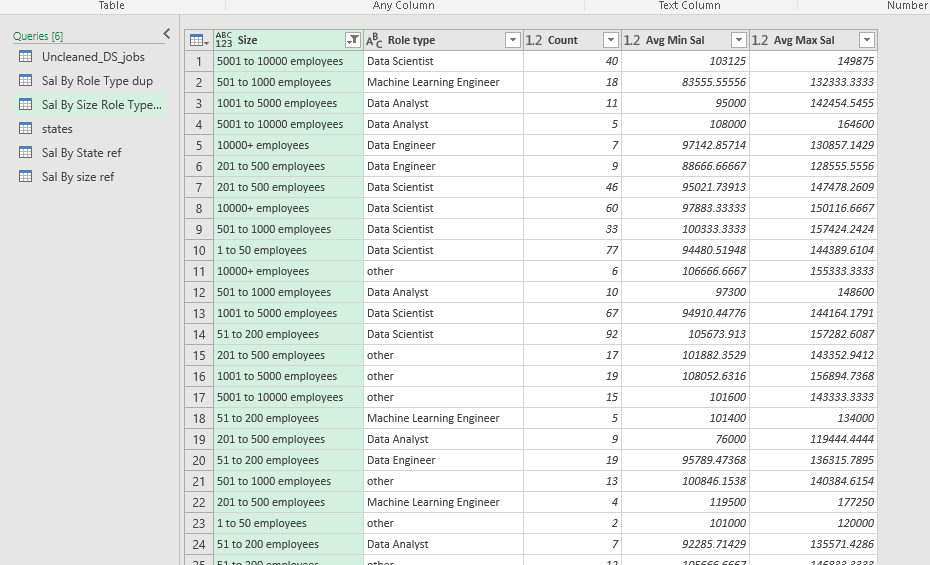
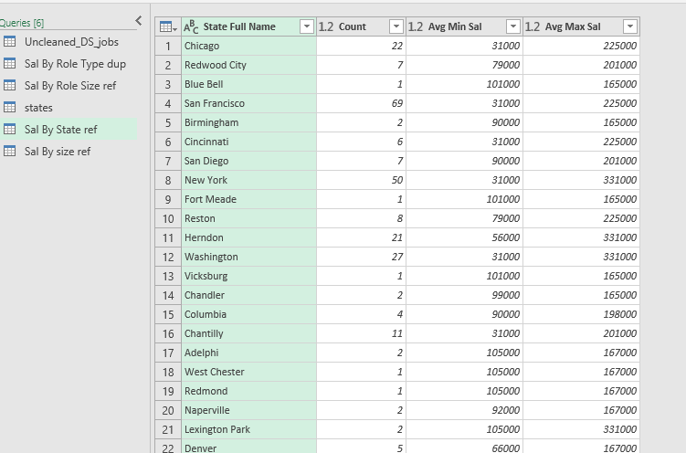
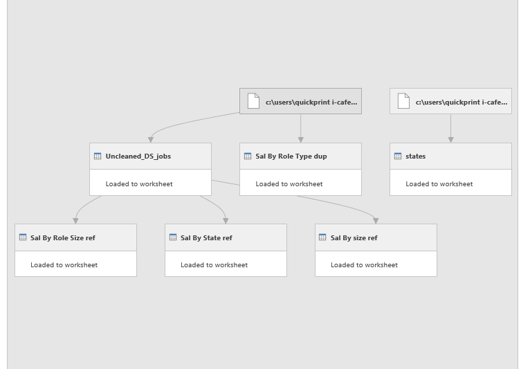

# Midterm Lab Task 2 Data Cleaning and Preparation using Power Query

For this task we are given a Flat data from Excel (See rawfile) and we are Task to perform Data Cleaning and Preparation using Power Query

## Step 1 Data Cleaning Process
- Load the raw file
- Duplicate the raw data
- Salary Estimate Column
- Create 2 New Columns (From the Salary Estimate) Min Sal and Max Sal
- ADD COLUMN – Role Type
- SPLIT COLUMNS by Delimeter
- Select Location column
- Filter New Column
- Handle negative values
## Here's the screenshot of my output before doing Cleaning and Transformation (See screenshot)

## Here's the screenshots of my final output (See screenshots)
- **Sal by Role Type**

- **Sal by Size**

- **Sal by Size Role Type**

- **Sal by State**

## Here's the Query Dependencies

