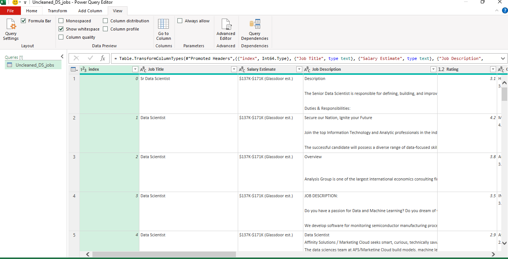
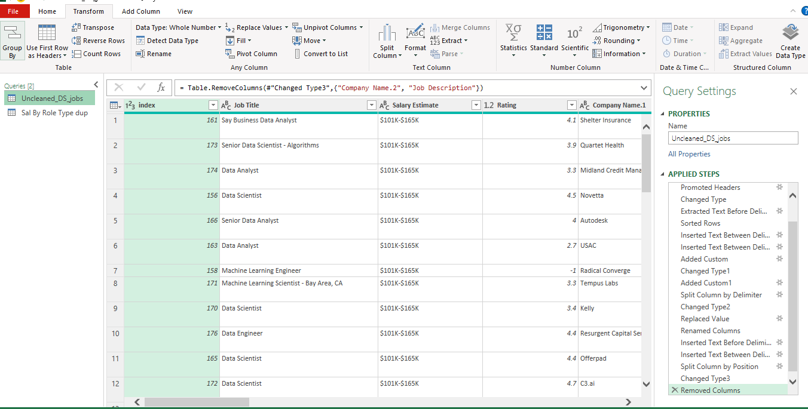
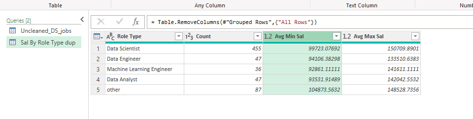
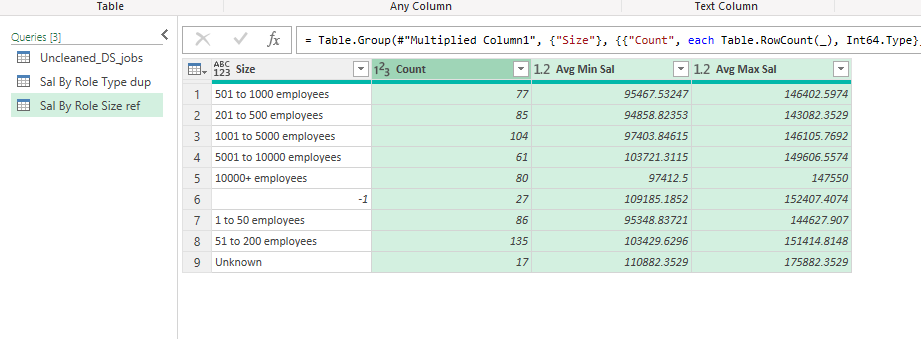
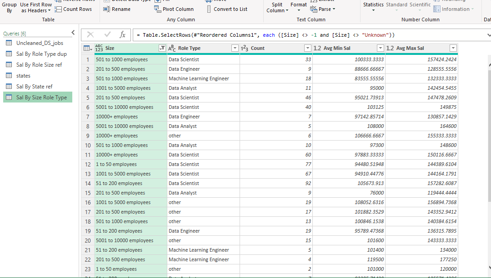
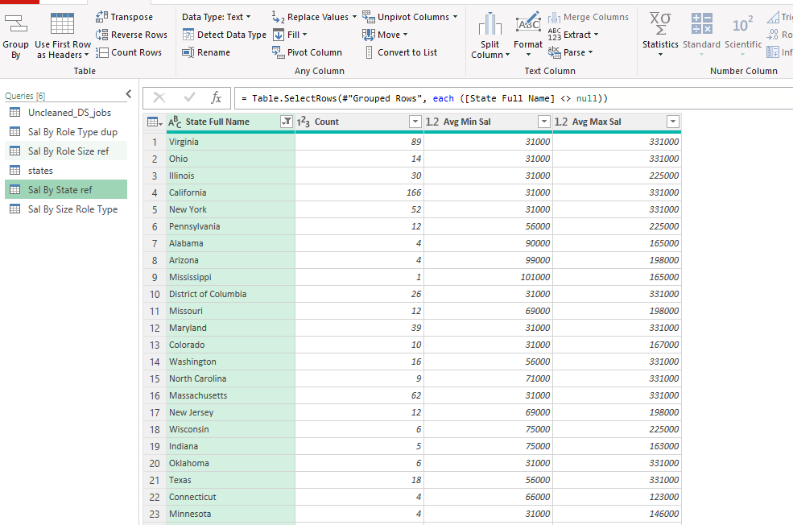
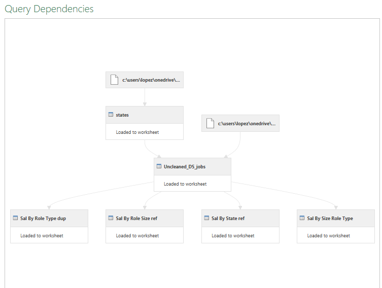

# Midterm Lab Task 2 Data Cleaning and Preparation using Power Query

For this task we are given a Flat data from Excel (See rawfile) and we are Task to perform Data Cleaning and Preparation using Power Query

## Task Description:
Company X would like to extract some useful information from the UnclenedDSJObs csv taken
from a Job Posting site available in Kaggle. There are a lot of columns available but focus only
on generating insights that will answer the ff: questions
1. Which Job Roles pay the highest and least
2. What size companies pay the best
3. Where Job Roles or Job Titles pay the best and least in a specific state

## Step 1 Data Cleaning Process
- Load the raw file
- Duplicate the raw data
- Salary Estimate Column
- Create 2 New Columns (From the Salary Estimate) Min Sal and Max Sal
- ADD COLUMN – Role Type
- SPLIT COLUMNS by Delimeter
- Select Location column
- Filter New Column
- Handle negative values
## Step 2 Here's the screenshot of my output before I started data cleaning using power query (See screenshot)

## Step 3 Here's the screenshot of my output after I started data cleaning using power query (See screenshot)

## Step 4 Here's the screenshots of my group tables using power query (See screenshots)
- **Sal by Role Type**

- **Sal by Size**

- **Sal by Size Role Type**

- **Sal by State**

## Here's the Query Dependencies

